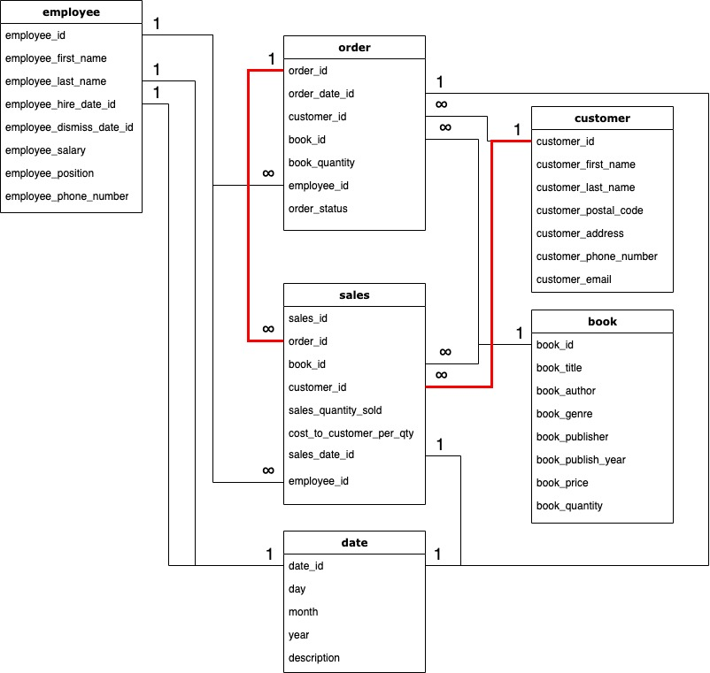
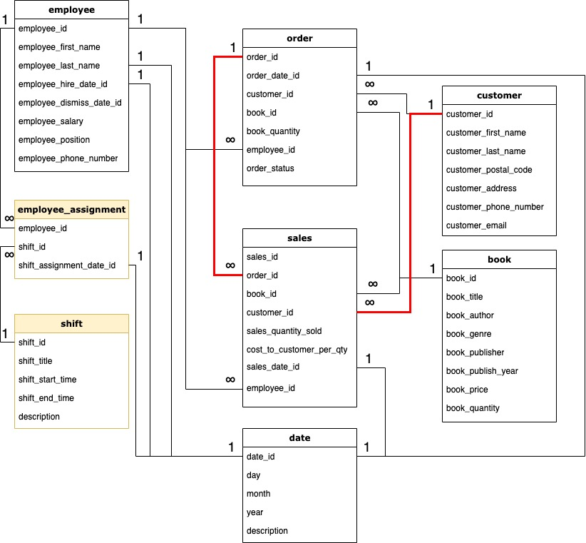
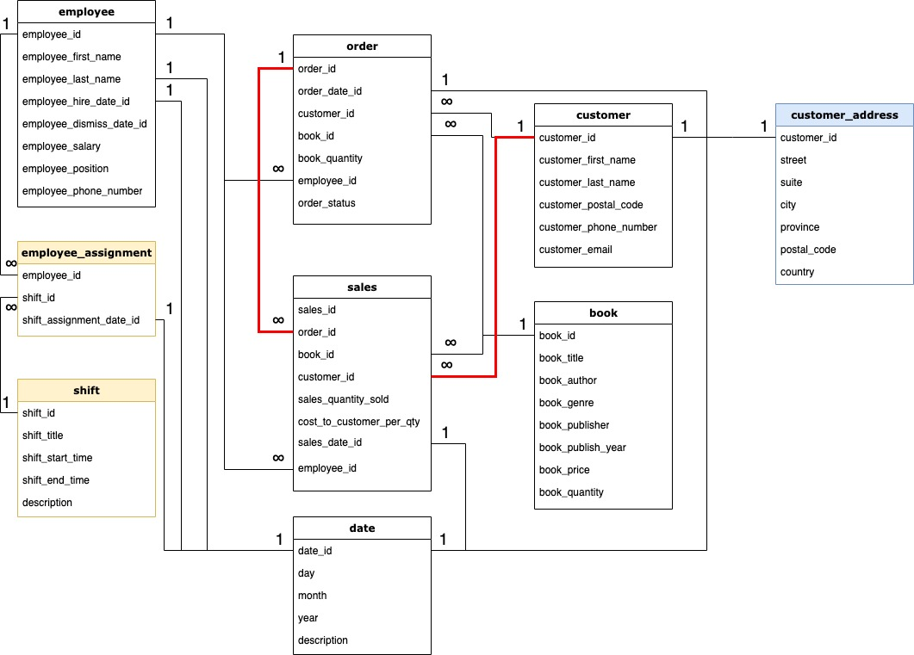
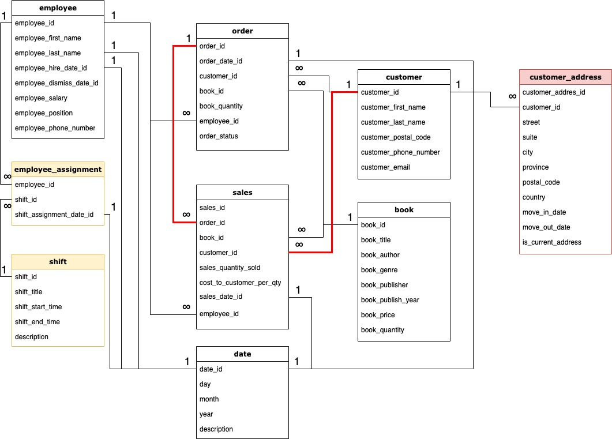

# Assignment 1: Design a Logical Model

## Question 1
Create a logical model for a small bookstore. 📚

At the minimum it should have employee, order, sales, customer, and book entities (tables). Determine sensible column and table design based on what you know about these concepts. Keep it simple, but work out sensible relationships to keep tables reasonably sized. Include a date table. There are several tools online you can use, I'd recommend [_Draw.io_](https://www.drawio.com/) or [_LucidChart_](https://www.lucidchart.com/pages/).

## ANSWER 1
Here is the ERD for the first question.
I have added Date table to this ERD, but I think it is not great idea to do this.


## Question 2
We want to create employee shifts, splitting up the day into morning and evening. Add this to the ERD.

## ANSWER 2
Here is the ERD for the second question.


## Question 3
The store wants to keep customer addresses. Propose two architectures for the CUSTOMER_ADDRESS table, one that will retain changes, and another that will overwrite. Which is type 1, which is type 2?

_Hint, search type 1 vs type 2 slowly changing dimensions._

Bonus: Are there privacy implications to this, why or why not?

## ANSWER 3
1. Architecture that overwrites the existing value with the new value and does not retain history is Type 1 Slowly Changing Dimension.
2. Architecture that adds a new row for the new value and keeps the existing row to retain history is Type 2 Slowly Changing Dimension.
3. (Bonus): Retaining customer addresses (Type 2) raises privacy concerns because storing old addresses could expose sensitive historical data. To mitigate this, ensure compliance with data protection laws like GDPR by securely handling and anonymizing data when needed.
4. Type 1 Architecture:

5. Type 2 Architecture:


```
Your answer...
```

## Question 4
Review the AdventureWorks Schema [here](https://i.stack.imgur.com/LMu4W.gif)

Highlight at least two differences between it and your ERD. Would you change anything in yours?

## ANSWER 4
1. AdventureWorks divides its database tables into schemas based on their purpose.
2. AdventureWorks has way more detailed entities, has more than one table to descripe one entity for things like sales or employees, while my model keeps this simpler.
3. At the moment, I would not expand my model much, while the business is small. As the business grows, I began to think about detailing the ERD, I would definitely add new entities, such as `Manufaturers`, `Vendors`, `Suppliers`.

# Criteria

[Assignment Rubric](./assignment_rubric.md)

# Submission Information

🚨 **Please review our [Assignment Submission Guide](https://github.com/UofT-DSI/onboarding/blob/main/onboarding_documents/submissions.md)** 🚨 for detailed instructions on how to format, branch, and submit your work. Following these guidelines is crucial for your submissions to be evaluated correctly.

### Submission Parameters:
* Submission Due Date: `September 28, 2024`
* The branch name for your repo should be: `model-design`
* What to submit for this assignment:
    * This markdown (design_a_logical_model.md) should be populated.
    * Two Entity-Relationship Diagrams (preferably in a pdf, jpeg, png format).
* What the pull request link should look like for this assignment: `https://github.com/<your_github_username>/sql/pull/<pr_id>`
    * Open a private window in your browser. Copy and paste the link to your pull request into the address bar. Make sure you can see your pull request properly. This helps the technical facilitator and learning support staff review your submission easily.

Checklist:
- [ ] Create a branch called `model-design`.
- [ ] Ensure that the repository is public.
- [ ] Review [the PR description guidelines](https://github.com/UofT-DSI/onboarding/blob/main/onboarding_documents/submissions.md#guidelines-for-pull-request-descriptions) and adhere to them.
- [ ] Verify that the link is accessible in a private browser window.

If you encounter any difficulties or have questions, please don't hesitate to reach out to our team via our Slack at `#cohort-4-help`. Our Technical Facilitators and Learning Support staff are here to help you navigate any challenges.
